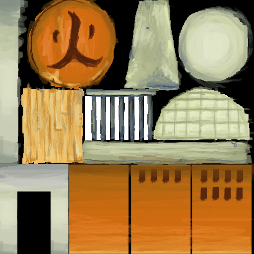

# Hokage Office and Scene Viewer

A web-based 3D viewer for the Hokage Office building and additional Naruto universe scenes, built with Three.js.



## Overview

This project provides an interactive 3D viewer that allows users to explore the Hokage Office building and other scenes from the Naruto universe in a web browser. The application features:

- Multiple detailed 3D scenes:
  - Hokage Office - Detailed FBX model with textures
  - Hokage Room - Full room interior (GLB format)
  - Naruto Village - Explorable village environment
  - Resort - Peaceful vacation location
  - Hot Spring - Traditional Japanese onsen
- Orbit controls for navigation (rotate, pan, zoom)
- Scene-specific camera positioning and scaling
- Fallback stylized model if the FBX cannot be loaded
- Atmospheric elements including sky, clouds, and proper lighting
- Dynamic visual effects:
  - Weather systems (rain, snow)
  - Time-of-day lighting changes (day, night, sunset)
- Responsive design that works on various screen sizes
- Fullscreen mode support

## Getting Started

### Prerequisites

- A modern web browser (Chrome, Firefox, Safari, or Edge)
- Local web server for development

### Installation

1. Clone this repository or download the files
2. Download the required Three.js files as specified in SETUP_INSTRUCTIONS.md
3. Place the files in the appropriate directories:
   ```
   project/
   ├── index.html
   ├── js/
   │   ├── three.min.js
   │   └── loaders/
   │       ├── GLTFLoader.js
   │       ├── FBXLoader.js
   │       └── OrbitControls.js
   ├── hokage-office/
   │   ├── source/
   │   │   └── Hokage_Office.fbx
   │   └── textures/
   │       ├── EntranceRoof_Texture.png
   │       ├── EntranceWall_Texture.png
   │       ├── Ground_Texture.png
   │       ├── Office_TEXTURE.png
   │       ├── Pole_Texture.png
   │       ├── Silo_Texture.png
   │       ├── Tree_texture.png
   │       └── Wall_Texture.png
   ├── Scenes/
   │   ├── scene1_HokageRoom.glb
   │   ├── scene2_NarutoVillage.glb
   │   ├── scene3_Resort.glb
   │   └── scene4_HotSpring.glb
   └── README.md
   ```

### Running the Project

Due to browser security restrictions when loading external files, you need to run the project using a local web server:

#### Using Python's built-in HTTP server
```
# Python 3
python -m http.server

# Python 2
python -m SimpleHTTPServer
```

#### Using Node.js
```
# Install http-server
npm install -g http-server

# Run server
http-server
```

After starting your local server, navigate to `http://localhost:8000` (or the port specified by your server) in your web browser.

## Usage

- **Rotate**: Click and drag with the left mouse button
- **Pan**: Click and drag with the right mouse button or CTRL + left mouse button
- **Zoom**: Scroll the mouse wheel or use pinch gestures on touchscreens
- **Scene Selection**: Click on the scene buttons to switch between environments
- **Return to Character**: Click the "Return to Character" button to go back to character view
- **Fullscreen**: Click the "Fullscreen" button in the bottom-right corner

## Features

### 3D Model Rendering
The application loads detailed 3D models in both FBX and GLB formats. The Hokage Office is loaded as an FBX model, while additional scenes use GLB format for optimal loading.

### Scene-Specific Configuration
Each scene has specific configuration settings for:
- Scale - Appropriate sizing for the environment
- Camera position - Optimal viewing angle 
- Camera target - Focus point for the orbit controls

### Realistic Lighting
The scene includes multiple light sources for realistic illumination:
- Directional lights simulating sunlight
- Ambient light for overall scene brightness
- Shadows for depth and realism
- Time-of-day variations (day, night, sunset)

### Environmental Effects
- Sky background with subtle gradient
- Animated cloud particles
- Dynamic weather effects (rain, snow)
- Ground plane with texture
- Atmospheric fog

## Integration
This module is integrated with the character animation system, allowing seamless switching between character and environment views.

## Browser Compatibility

The application has been tested and works on:
- Google Chrome (latest)
- Mozilla Firefox (latest)
- Microsoft Edge (latest)
- Safari (latest)

## License

This project is for educational purposes only.

## Acknowledgments

- Three.js for the 3D rendering capabilities
- The Naruto series for the iconic scenes and environments 